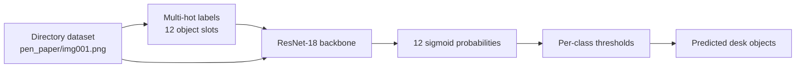

# VisionTagger

VisionTagger is a personal ML engineering project for **multi-label desk
inventory recognition**. The goal is to recognize everyday objects in a desk or
study setup, such as a laptop, phone, keys, notebook, calculator, bottle, and
backpack.

This started as a compact image-classification prototype and is being expanded
into a cleaner, reproducible PyTorch project: reusable package code,
config-driven scripts, inference tooling, local demo support, and documented
evaluation.

## Why This Project

My desk changes constantly while I study, code, and get ready to leave home. A
single-label classifier is not enough because one image can contain many useful
objects at once. VisionTagger treats the problem as multi-label recognition:
each image can activate any subset of 12 labels.

The useful learning questions are:

- How do transfer learning and scratch training compare on a small custom image
  task?
- How should multi-label thresholds be tuned when classes have different
  frequencies?
- Which metrics tell the truth when exact-match accuracy is much harder than
  per-label accuracy?
- How do you turn notebook/classroom code into a reusable ML project?

## Architecture



## Labels

```text
pen, paper, book, clock, phone, laptop,
chair, desk, bottle, keychain, backpack, calculator
```

## Repository Layout

```text
src/vision_tagger/     reusable package code
scripts/               train, evaluate, predict, and demo entrypoints
configs/default.yaml   default training and inference configuration
docs/                  model card, artifact policy, experiment notes
tests/                 smoke tests for data, metrics, model, and thresholds
figures/               selected training/evaluation plots
```

## Dataset Layout

Training and evaluation data use folder names as labels:

```text
aggregated/
  pen/
    img001.png
  pen_paper/
    img002.png
  laptop_phone_book/
    img003.png
```

The private/course dataset is not included. To reproduce locally, provide a
compatible `aggregated/` directory or a small sample dataset with the same
layout.

Model artifacts are distributed separately from source control. See
[`docs/ARTIFACTS.md`](docs/ARTIFACTS.md) for download and regeneration steps.

## Setup

```bash
pip install uv
uv sync
```

For the local demo:

```bash
uv sync --extra demo
```

## Train

```bash
uv run python scripts/train.py --config configs/default.yaml
```

The script saves the best checkpoint and learned thresholds under the configured
`training.output_dir`.

## Evaluate

```bash
uv run python scripts/evaluate.py \
  --data project_test_data \
  --model artifacts/best_cnn_model.pth \
  --thresholds artifacts/cnn_thresholds.pt
```

## Predict

```bash
uv run python scripts/predict.py \
  --image path/to/desk_image.png \
  --model artifacts/best_cnn_model.pth \
  --thresholds artifacts/cnn_thresholds.pt
```

Use `--json` for machine-readable output.

## Local Demo

```bash
uv run python scripts/demo.py \
  --model artifacts/best_cnn_model.pth \
  --thresholds artifacts/cnn_thresholds.pt
```

## Current Results

The saved transfer-learning run selected epoch 12 as the best checkpoint by
validation loss. Approximate validation metrics from the logged run:

| Model | Exact Match | Hamming Accuracy | Macro F1 |
| --- | ---: | ---: | ---: |
| ResNet-18 transfer learning | 0.49 | 0.92 | 0.75 |
| Scratch ResNet-18 baseline | See `docs/EXPERIMENTS.md` | See `docs/EXPERIMENTS.md` | See `docs/EXPERIMENTS.md` |
| Mode labelset baseline | See `docs/EXPERIMENTS.md` | See `docs/EXPERIMENTS.md` | See `docs/EXPERIMENTS.md` |

## What I Learned So Far

- Multi-label tasks need different metrics than single-label classification.
- Hamming accuracy can look strong even when exact label-set prediction is still
  difficult.
- Per-class thresholds are useful because each object appears at a different
  frequency.
- Transfer learning gives a much better starting point than training a ResNet
  from scratch on a small custom dataset.
- Turning training code into a package forces better boundaries between data,
  model, metrics, inference, and scripts.

## Next Experiments

- Build a small personal desk-image dataset to test the system outside the
  original training distribution.
- Add ONNX export for portable inference.
- Add experiment tracking for threshold and augmentation changes.
- Try a lighter model for faster local CPU inference.
